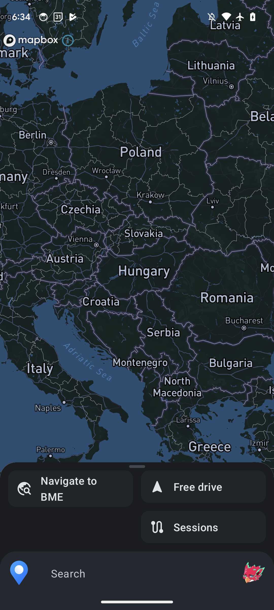
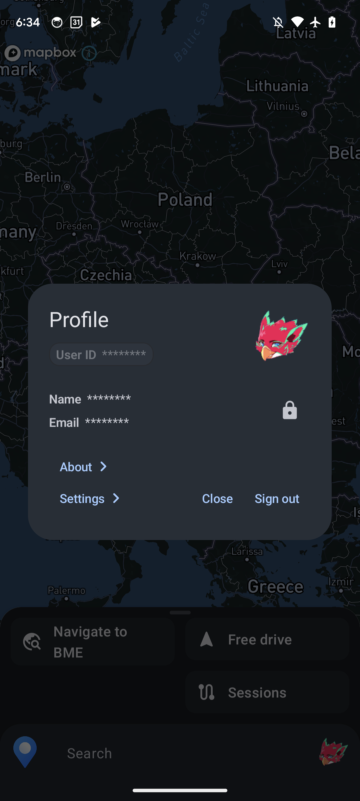
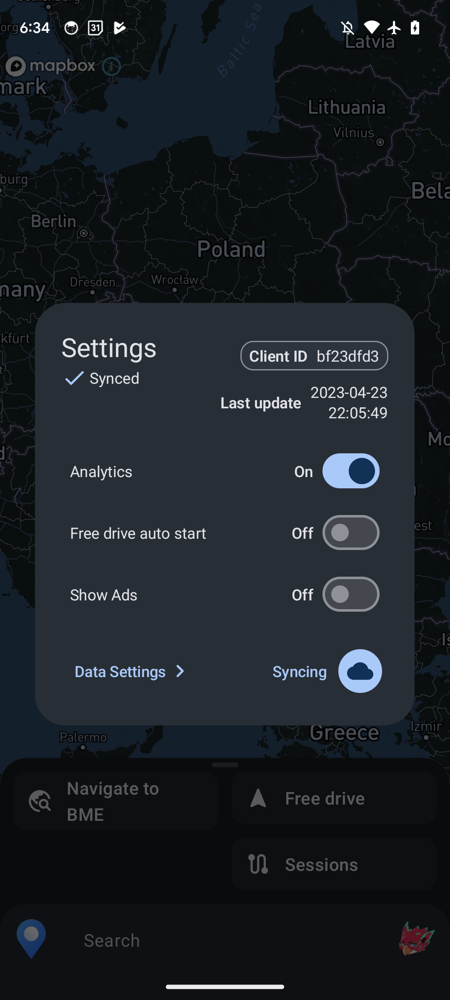
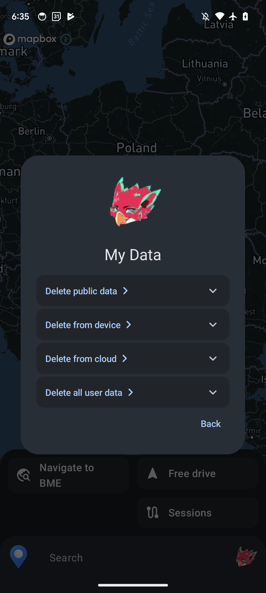
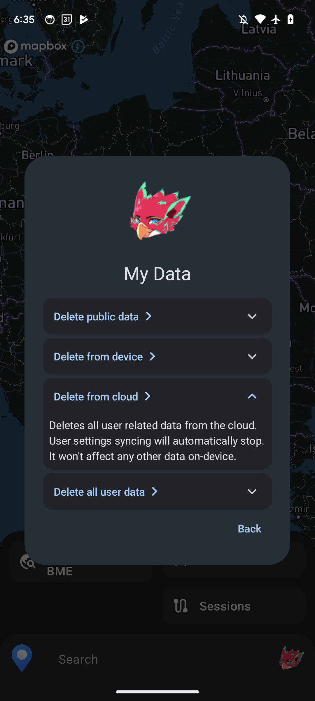
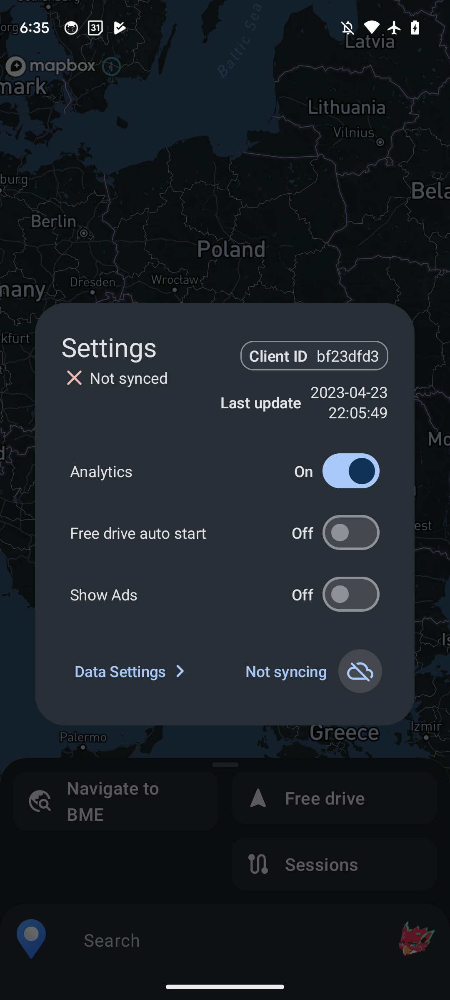

# Data Deletion

Jay Android App provides ways to delete user data from the cloud and device.

Follow the steps below to get your data deleted.

## Steps

### Open the App

Make sure, no Session is running to avoid any problems during deletion. Make sure, that the button on `Free drive` screen says `Start free-drive`, or no instance of Jay is running in the background.

### Open Profile dialog

### Go to Settings

### Go to Data Settings

### Expand options to see more

Expanding an option reveals more information about them. To sum it up:

- Delete public data: deleting public data available to everyone on the device. This means, all public data is deleted or reset, which is generated by the offline (unidentified) user.
- Delete from device: deleting own data from the device, clearing any data stored on the device linked to you.
- Delete from cloud: deleting all of your data from the cloud, erasing your existance from Firestore servers.
- Delete all user data: deletes user data from the device and from the cloud.

### Delete all user data

Deleting all user data resets and stops syncing user preferences to avoid automatically uploading it to the cloud.

### Go back to Settings

And notice, that user preferences were reset and syncing was stopped, no data is sent to the cloud.

## Reach out

If you encounter any problem during the process, contact me via any of the platforms listed on my [GitHub Profile Page](https://github.com/hlcaptain).
